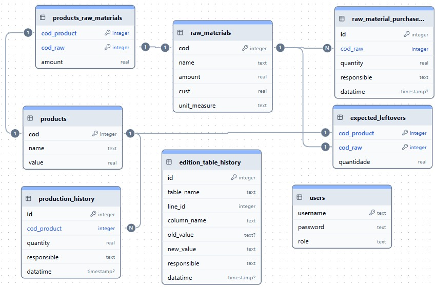
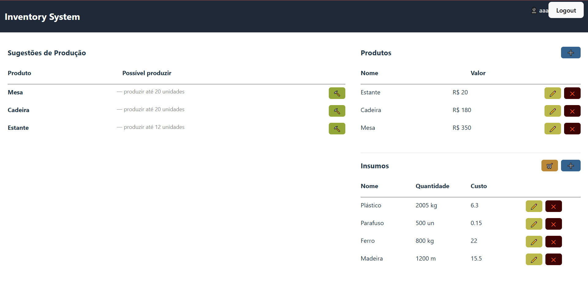
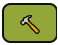
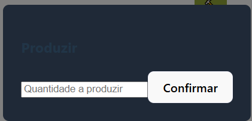
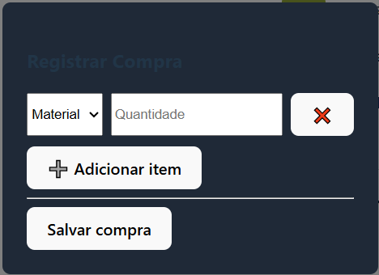
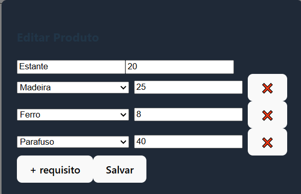
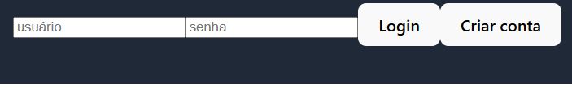

# TestePratico-Autoflex
Esse repositório é destinado a resolver o problema dado por Projedata para candidatar-se à vaga Desenvolvedor de Software Full Stack Júnior

Atensão o site do link às vezes tem atraso de até 50s para acordar o servidor devido ao render.

# Enunciado:

## Descrição do problema:
Uma indústria que produz produtos diversos, necessita controlar o estoque dos insumos (matérias-primas) necessárias para a produção dos itens que fabrica. Para isso será necessário o desenvolvimento de um sistema que permita manter o controle dos produtos e das matérias-primas que são utilizadas para a produção de cada produto.

Para o produto devem ser armazenados, além do código, o nome e o valor.

Para as matérias-primas, além do código, também devem armazenados o nome e quantidade em estoque. Obviamente, deverá ser feito a associação dos produtos e das matérias primas que o compõem, com as respectivas quantidades necessárias de cada matéria prima para produzir o produto.

Além da manutenção dos cadastros, deseja-se saber quais produtos (e quais quantidades) podem ser produzidos com as matérias-primas em estoque, e o valor total que será obtido com a produção sugerida pelo sistema.

A priorização de quais produtos devem ser sugeridos pelo sistema, deve ser pelos produtos de maior valor, uma vez que uma determinada matéria-prima pode ser utilizada em mais de um produto.

## Requisitos:

### Requisitos não funcionais:
RNF001 – O sistema deverá ser desenvolvido para a plataforma WEB, sendo possível a execução nos principais navegadores (Chrome, Firefox, Edge).

RNF002 – O sistema deverá ser construído utilizando o conceito de API, ou seja, separar o back-end do front-end.

RNF003 – As telas desenvolvidas no front-end devem utilizar os recursos de responsividade.

RNF004 – A persistência de dados deve ser realizada em Sistema Gerenciador de Banco de Dados, com a possibilidade de utilizar Postgres, MySql ou Oracle. Caso tenha instalado o Oracle, a sugestão é utilizá-lo.

RNF005 – O back-end (API) deve ser desenvolvido utilizando algum framework, como Spring, Quarkus ou similar. Caso você conheça Quarkus, a sugestão é que aplique já que é uma das tecnologias utilizadas no Autoflex.

RNF006 – O front-end pode ser desenvolvido utilizando qualquer linguagem ou framework que possibilite o atendimento dos requisitos. Caso você conheça React e Redux, a sugestão é que aplique já que são tecnologias utilizadas no Autoflex.

RNF007 – Tanto a codificação do back-end, front-end, tabelas e colunas do banco de dados devem ser desenvolvidas utilizando a língua inglesa.

### Requisitos funcionais:

RF001 – Desenvolver no back-end as funcionalidades CRUD para manter o cadastro de produtos.

RF002 – Desenvolver no back-end as funcionalidades CRUD para manter o cadastro de matérias primas.

RF003 – Desenvolver no back-end as funcionalidades CRUD para associar matérias-primas aos produtos.

RF004 – Desenvolver no back-end as funcionalidades para a consulta dos produtos que podem ser produzidos com as matérias-primas disponíveis em estoque.

RF005 – Desenvolver no front-end uma interface gráfica que possibilite realizar as operações CRUD para manter o cadastro de produtos.

RF006 – Desenvolver no front-end uma interface gráfica que possibilite realizar as operações CRUD para manter o cadastro de matérias primas.

RF007 – Desenvolver no front-end uma interface gráfica que possibilite realizar as operações CRUD para associar matérias-primas aos produtos. Não há a necessidade de ser uma tela separada, podendo ser inserida a interface no cadastro de produtos.

RF008 – Desenvolver no front-end uma interface gráfica que possibilite listar quais produtos (e quais quantidades) podem ser produzidos com as matérias-primas disponíveis em estoque.

## Desejável:

- Desenvolvimento de testes unitários para o back-end e para o front-end

- Desenvolvimento de testes de integração. Caso tenha conhecimento da tecnologia Cypress, a sugestão é utilizá-la já que utilizamos no Autoflex.

# Solução 

## 01 Banco de dados




Para resolver os requisitos optei por criar as tabelas `production_raw_materials`, `raw_materials` e `products`.
Entretanto tendando resolver um problema mais realista gerei outras tabelas:

- `edition_table_history` que registra quase qualquer alteração no banco de dados.
- `user` para permitir login e validação de quem fez a modificação.
- `production_history` para que registremos quais materiais foram produzidos
- `raw_material_purchase` para registro de compras de materia prima já registrada
- `expected_leftovers` não foi usado mas tinha como ideia central registrar sobras que pudessem ser adicionadas aos materiais, uma possivél melhoria.

## 02 Back-end
Ele foi feito usando node.js e conta com CRUD completo para todas as tabelas, além de:

- Garantir registro no histórico para CRUD em `products`, `products_raw_materials` e `raw_materials`;
- A subitração de matéria prima em estoque no CRUD em `production_history`.

## 03 Front-end

A ideia central foi um "deshboard" com toda a informação que se precisa na tela.



Do lado direito temos as suggestões de produção ordenadas por valor de produto como solicitado.
Com botões  para informar a produção, onde são pedidos a quantidade a ser produzida.



Na esquerda temos os cadastros de Produtos e Materiais com os botões:

-  para adicionar produtos, relações e materiais;
-  para editar os valores do respectivo produto ou material;
-  para deletar o respectivo produto ou material;
-  para registrar uma lista de aquisições dos materiais já registrados como a baixo:



Vale ressaltar que as relções entre materiais e produtos são criadas e editadas no proprio registro de produtos:



Contenho também area para login, singup e logout. Vale informar que sem um login não é possível fazer qualquer alteração no banco de dados. 




ainda não foi configurado mas a ideia é que não seja permitido que usuarios comuns usem botoes de edição, inserção ou deleção - isso é ele só poderia usar compras e produção.

# Melhorias

Como melhoria claramente e gritantemente coloco impedir que seja deletado uma materia prima que é dependencia de algum produto. 

Além disso o botão de produzir não dispara ainda alarme

Fazer um gerenciamento de tipo de usuario;

e claro por em pratica a tabela `expected_leftovers`

# Instalação

Para a instalação deixei super simples :)

depois de clonar entre no diretório do projeto 

`cd .\TestePratico-Autoflex\`

basta rodar em ordem os seguintes comandos:

- ```npm init -y```
- ```npm install``` 
- ```npm run dev```

caso queira rodar individualmente o front-end ou o back-end basta entrar, respectictivamente, na pasta `web` (`cd web`) ou `api` (`cd api`) e rodar em ordem os comandos a cima.


## Banco de dados

antes de qualquer coisa precisamos de um banco de dados.
na pasta `db`temos o schema do banco adapitado para oracle XE e schema.sqlite.sql que usarei para facilitar o uso para qualquer usuário.
esses bancos serão gerados altomaticamente pela api.

Um schema.sql para oracle existe, mas ainda não foi testado, apesar de eu ter me exforçado para manter um padrão compativel com oracle.db não pude testar-lo por precisar reiniciar o pc a fim de reinstalar meu wsl que corrompi recentemente (deletei partes dele). A reiniciação interromperia o meu teste então optei por fazer em sqlite.

